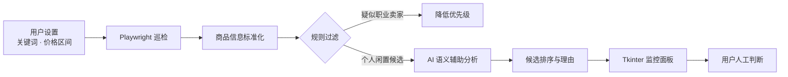

# TradeSniper · 二手商品智能监控工具

> 用浏览器自动化、规则过滤与 AI 辅助分析，减少二手平台商品筛选中的重复劳动。

TradeSniper 是一个基于 Python 的桌面端原型，覆盖关键词巡检、职业卖家过滤、候选商品分析与可视化监控。它把数据采集和决策辅助串成一条可操作流程，但不会替用户完成交易，也不保证商品真实性或投资回报。

| 项目维度 | 说明 |
| --- | --- |
| **产品类型** | 自动化信息采集与 AI 辅助筛选工具 |
| **核心问题** | 二手商品信息量大、重复浏览成本高、商家内容干扰判断 |
| **系统输出** | 关键词巡检结果、规则过滤、候选分析与实时运行日志 |
| **工程重点** | 浏览器会话管理、采集稳定性、规则与模型协同、桌面端可视化 |

## 从海量信息到候选商品



系统把确定性的规则放在模型之前：先处理批量供货话术、库存模式和价格异常，再把更少、更相关的候选交给模型分析。这样既降低调用成本，也避免把模型当作唯一判断来源。

## ✨ 核心功能

- **智能巡逻**: 自动化遍历商品列表，实时监控目标关键词。
- **AI 辅助决策**: 集成 DeepSeek 大模型，对商品描述和上下文进行语义分析，为候选结果补充判断理由。
- **商家过滤**: 结合关键词、库存模式和价格区间识别疑似职业卖家，降低干扰信息优先级。
- **可视化大屏**: 提供基于 Tkinter 的现代化监控面板，实时展示巡逻日志与潜在机会。
- **无头模式**: 支持后台静默运行，低资源占用。
- **多模式登录**: 支持二维码扫码登录，自动维护会话状态。

## 🏗️ 项目架构

项目采用模块化分层架构设计，遵循单一职责原则：

```
TradeSniper/
├── src/                    # 源代码根目录
│   ├── core/               # 核心业务逻辑
│   │   ├── engine.py       # 巡逻引擎与决策中心
│   │   └── sniper.py       # 浏览器自动化与会话管理
│   ├── ui/                 # 图形用户界面
│   │   └── app.py          # Tkinter 主程序
│   ├── config/             # 配置管理
│   │   └── settings.py     # 全局常量与策略配置
│   ├── utils/              # 通用工具库
│   └── main.py             # 程序入口
├── scripts/                # 运维与辅助脚本
│   ├── get_token.py        # 登录态获取工具
│   └── check_venv.py       # 环境自检工具
├── tests/                  # 单元测试与集成测试
├── docs/                   # 项目文档
├── requirements.txt        # 项目依赖
└── README.md               # 项目说明文档
```

## 🚀 快速开始

### 环境要求

- Python 3.8+
- Chrome/Edge 浏览器

### 安装步骤

1. **克隆仓库**
   ```bash
   git clone https://github.com/cheng-Lokesh/tradesniper.git
   cd tradesniper
   ```

2. **创建并激活虚拟环境**
   ```bash
   python -m venv .venv
   # Windows
   .venv\Scripts\activate
   # Linux/macOS
   source .venv/bin/activate
   ```

3. **安装依赖**
   ```bash
   pip install -r requirements.txt
   playwright install chromium
   ```

4. **配置环境**
   在本地 `.env` 中配置 `DEEPSEEK_API_KEY`；如需消息通知，可选配 `SERVER_CHAN_KEY`。不要把密钥提交到仓库。

### 运行程序

**方式一：启动图形化界面（推荐）**
```bash
python src/main.py
```
或者直接双击根目录下的 `run.bat` 脚本。

**方式二：获取登录凭证**
```bash
python scripts/get_token.py
```
运行后扫码登录，生成的 `state.json` 将自动被主程序识别。

## 🛠️ 技术栈

- **语言**: Python 3
- **爬虫**: Playwright (Async/Sync)
- **GUI**: Tkinter + TTK
- **AI**: DeepSeek API (OpenAI Compatible)
- **其他**: Dotenv, Threading, Subprocess

## 工程边界

- 页面结构、登录流程或平台风控策略变化时，自动化采集可能需要适配。
- AI 输出只用于候选排序和信息辅助，商品真实性与交易风险必须由用户自行核验。
- 项目不自动下单、不代替议价，也不提供收益承诺。

## 🤝 贡献指南

欢迎提交 Issue 或 Pull Request。在提交代码前，请确保通过所有单元测试并遵循项目的编码规范。

## 📄 许可证

MIT License
